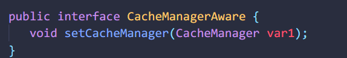

# [高速缓存](http://shiro.apache.org/caching.html#caching)

性能对于程序至关重要。虽然缓存只是shiro基础组件的一个概念，但是Shiro实现了完整的缓存机制将。为此，Shiro的缓存支持基本上是一个抽象（包装）的API，它位于缓存框架智商（例如Hazelcast，Ehcache，OSCache，Terracotta，Coherence，GigaSpaces，JBossCache等）。所以Shiro可以与大部分环境框架进行整合。

## [缓存API](http://shiro.apache.org/caching.html#caching-api)

Shiro有三个重要的缓存接口：

- [`CacheManager`](http://shiro.apache.org/static/current/apidocs/org/apache/shiro/cache/CacheManager.html)- 所有缓存的主要管理者组件，它返回`Cache`实例。
- [`Cache`](http://shiro.apache.org/static/current/apidocs/org/apache/shiro/cache/Cache.html) - 键值对
- [`CacheManagerAware`](http://shiro.apache.org/static/current/apidocs/org/apache/shiro/cache/CacheManagerAware.html) - 由接受和使用一CacheManager实例的一个组件实现

一个`CacheManager` 返回`Cache` 对象, 各个Shiro组件使用这些Cache对象来缓存数据。所有实现`CacheManagerAware` 的组件将自动接收配置好的`CacheManager` 对象,  可用于获取`Cache`实例。



Shiro [SecurityManager](http://shiro.apache.org/securitymanager.html)实现以及所有[`AuthenticatingRealm`](http://shiro.apache.org/static/current/apidocs/org/apache/shiro/realm/AuthenticatingRealm.html)和[`AuthorizingRealm`](http://shiro.apache.org/static/current/apidocs/org/apache/shiro/realm/AuthorizingRealm.html)实现都实现了CacheManagerAware。如果你设置`CacheManager`的`SecurityManager`，它会反过来把它放在实现CacheManagerAware以及（OO代表团）的各个领域。例如，在shiro.ini中：

**示例shiro.ini CacheManager配置**

```ini
securityManager.realms = $myRealm1, $myRealm2, ..., $myRealmN
...
cacheManager = my.implementation.of.CacheManager
...
securityManager.cacheManager = $cacheManager
# at this point, the securityManager and all CacheManagerAware
# realms have been set with the cacheManager instance
```

## [CacheManager实现](http://shiro.apache.org/caching.html#cachemanager-implementations)

Shiro提供了许多开箱`CacheManager`即用的实现，您可能会发现这些实现很有用，而不是实现自己的实现。

### [MemoryConstrainedCacheManager](http://shiro.apache.org/caching.html#memoryconstrainedcachemanager)

这[`MemoryConstrainedCacheManager`](http://shiro.apache.org/static/current/apidocs/org/apache/shiro/cache/MemoryConstrainedCacheManager.html)是一个`CacheManager`适用于单JVM生产环境的实现。它不是集群/分布式的，因此如果您的应用程序跨越多个JVM（例如，在多个Web服务器上运行的Web应用程序），并且您希望跨JVM可以访问缓存条目，则需要使用分布式缓存实现。

该`MemoryConstrainedCacheManager`管理[`MapCache`](http://shiro.apache.org/static/current/apidocs/org/apache/shiro/cache/MapCache.html)的情况下，一个`MapCache`每个命名缓存实例。每个`MapCache`实例都由Shiro支持，Shiro [`SoftHashMap`](http://shiro.apache.org/static/current/apidocs/org/apache/shiro/util/SoftHashMap.html)可以根据应用程序的运行时内存约束/需求（通过利用JDK [`SoftReference`](https://docs.oracle.com/javase/7/docs/api/java/lang/ref/SoftReference.html)实例）自动调整自身大小。

因为`MemoryConstrainedCacheManager`可以根据应用程序的内存配置文件自动调整自身大小，所以可以安全地在单JVM生产应用程序中使用，也可以用于测试需求。但是，它没有更高级的功能，如缓存条目生存时间或到期时间设置。对于这些更高级的缓存管理功能，您可能希望使用`CacheManager`以下更高级的产品之一。

**MemoryConstrainedCacheManager shiro.ini配置示例**

```
...
cacheManager = org.apache.shiro.cache.MemoryConstrainedCacheManager
...
securityManager.cacheManager = $cacheManager
```

### [HazelcastCacheManager](http://shiro.apache.org/caching.html#hazelcastcachemanager)

TBD

### [EhCacheManager](http://shiro.apache.org/caching.html#ehcachemanager)

TBD

## [授权缓存失效](http://shiro.apache.org/caching.html#authorization-cache-invalidation)

最后请注意，[`AuthorizingRealm`](http://shiro.apache.org/static/current/apidocs/org/apache/shiro/realm/AuthorizingRealm.html)有一个[clearCachedAuthorizationInfo方法](http://shiro.apache.org/static/current/apidocs/org/apache/shiro/realm/AuthorizingRealm.html#clearCachedAuthorizationInfo-org.apache.shiro.subject.PrincipalCollection-)，子类可以调用该[方法](http://shiro.apache.org/static/current/apidocs/org/apache/shiro/realm/AuthorizingRealm.html#clearCachedAuthorizationInfo-org.apache.shiro.subject.PrincipalCollection-)来驱逐特定帐户的缓存authzInfo。如果相应帐户的authz数据已更改，则通常由自定义逻辑调用（以确保下一次authz检查将获取新数据）。