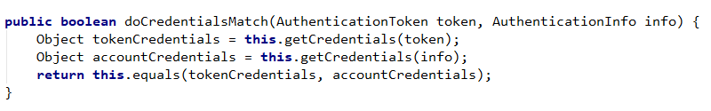
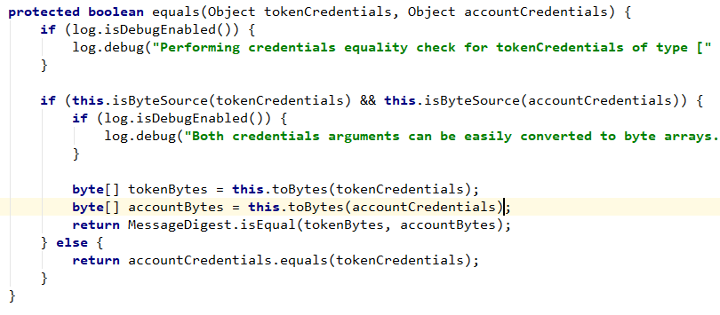
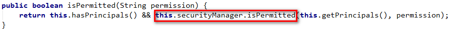

# Apache ShiroRealm

- [Realm配置](http://shiro.apache.org/realm.html#Realm-RealmConfiguration)
  - [明确配置](http://shiro.apache.org/realm.html#Realm-ExplicitAssignment)
  - [隐含配置](http://shiro.apache.org/realm.html#Realm-ImplicitAssignment)
- [Realm认证](http://shiro.apache.org/realm.html#Realm-RealmAuthentication)
  - [支持 `AuthenticationTokens`](http://shiro.apache.org/realm.html#Realm-Supporting%7B%7BAuthenticationTokens%7D%7D)
  - [处理支持的 `AuthenticationTokens`](http://shiro.apache.org/realm.html#Realm-Handlingsupported%7B%7BAuthenticationTokens%7D%7D)
  - 凭证匹配
    - [简单的相等检查](http://shiro.apache.org/realm.html#Realm-SimpleEqualityCheck)
    - 哈希匹配
      - [哈希和相应的匹配者](http://shiro.apache.org/realm.html#Realm-HashingandCorrespondingMatchers)
        - [`SaltedAuthenticationInfo`](http://shiro.apache.org/realm.html#Realm-%7B%7BSaltedAuthenticationInfo%7D%7D)
  - [禁用身份验证](http://shiro.apache.org/realm.html#Realm-DisablingAuthentication)
- [Realm授权](http://shiro.apache.org/realm.html#Realm-RealmAuthorization)
  - [基于角色的授权](http://shiro.apache.org/realm.html#Realm-RoleBasedAuthorization)
  - [基于权限的授权](http://shiro.apache.org/realm.html#Realm-PermissionBasedAuthorization)

****

 `Realm`是可以访问特定于应用程序的安全数据（如用户，角色和权限）的组件。`Realm`将这些数据转换成Shiro支持的形式,  所以无论有多少数据或者,  数据是什么样的格式,  我们都可以通过subject API进行操作。

Realm通常与数据源（例如关系数据库，LDAP目录，文件系统或其他类似资源）具有1对1的关联。因此，`Realm`的实现使用特定的数据源的API来发现授权数据（角色，权限等），例如JDBC，文件IO，Hibernate或JPA，或任何其他数据访问API。

> **Tips**
>
> Realm本质上是用于安全控制的[DAO](http://en.wikipedia.org/wiki/Data_Access_Object)

由于大多数的这些数据库通常同时存储认证数据（凭证，例如密码），以及授权数据（例如角色或权限），所以`Realm`可以执行认证和授权操作。

## [Realm配置](http://shiro.apache.org/realm.html#realm-configuration)

如果使用Shiro的INI配置，配置`Realm`和`[main]`区域中配置的其他对象一样,   它们可以通过以下两种方式之一进行配置在`securityManager` 中：显式或隐式。

### [显示配置](http://shiro.apache.org/realm.html#explicit-assignment)

这是一种显示的配置方法。定义一个或多个Realms后，将它们设置为`securityManager`对象上的集合属性。

例如：

```ini
fooRealm = com.company.foo.Realm
barRealm = com.company.another.Realm
bazRealm = com.company.baz.Realm

securityManager.realms = $fooRealm, $barRealm, $bazRealm
```

显式配置是确定性的 - 你可以精确的控制执行认证个授权操作的`Realm`的顺序。Realm[认证顺序](http://shiro.apache.org/authentication.html#Authentication-sequence)部分详细介绍了Realm排序效果。

### [隐式配置](http://shiro.apache.org/realm.html#implicit-assignment)

> **不推荐**
>
> 如果更改`Realm`的顺序，隐式配置可能会导致意外行为。建议您使用显示配置。可能会在未来的Shiro版本中弃用/删除这种配置方式。

如果由于某种原因您不想显式配置`securityManager.realms`属性，那么可以允许Shiro检测所有已配置的`Realm`并自动注入到`securityManager`。

使用此方法，`Realm` 按照定义的顺序自动注入到`securityManager`。

也就是说，对于以下`shiro.ini`示例：

```ini
blahRealm = com.company.blah.Realm
fooRealm = com.company.foo.Realm
barRealm = com.company.another.Realm

# no securityManager.realms assignment here
```

基本上和以下配置相同：

```ini
blahRealm = com.company.blah.Realm
fooRealm = com.company.foo.Realm
barRealm = com.company.another.Realm
securityManager.realms = $blahRealm, $fooRealm, $barRealm
```

但是，进行认证和授权操作时,  `realm`的配置顺序会直接影响认证和授权的结果。如果更改了配置顺序，那么也要对`Authenticator`的认证顺序进行修改。

出于这个原因，我们建议使用显示配置而不是隐式配置。

## [Realm认证](http://shiro.apache.org/realm.html#realm-authentication)

了解了Shiro的[认证流程](http://shiro.apache.org/authentication.html#Authentication-sequence)，那么执行认证操作时,  `Authenticator` 是如何与`Realm`进行交互的?

### 检查 `AuthenticationTokens` 类型

之前我们提到[认证顺序](http://shiro.apache.org/authentication.html#Authentication-sequence)，`Realm` 执行认证操作前，会调用`realm.supports(AuthenticationToken token)` 方法。只有当返回值为`true`，`getAuthenticationInfo(token)` 方法才会被调用。

通常，Realm将检查提交的token（接口或类）是否是支持的类型。例如，处理生物识别数据的Realm可能根本不理解`UsernamePasswordTokens`，在这种情况下`supports`会但会`false`。

### 处理支持 `AuthenticationTokens`

如果`Realm` 支持提交的`AuthenticationToken`，`Authenticator`则会调用Realm的[getAuthenticationInfo（token）](http://shiro.apache.org/static/current/apidocs/org/apache/shiro/realm/Realm.html#getAuthenticationInfo-org.apache.shiro.authc.AuthenticationToken-)方法。这代表`Realm`执行认证操作时查询后端数据。该方法依次为：

1. 检查`token`识别身份（帐户识别信息）
2. 基于此`principal`，在数据源中查找相应的帐户数据
3. 确保提供的`credentials`与存储在数据存储中的相匹配
4. 如果匹配，则返回[AuthenticationInfo](http://shiro.apache.org/static/current/apidocs/org/apache/shiro/authc/AuthenticationInfo.html)实例，该实例以Shiro理解的格式封装帐户数据
5. 如果凭据不匹配，则抛出[AuthenticationException](http://shiro.apache.org/static/current/apidocs/org/apache/shiro/authc/AuthenticationException.html)

这是所有Realm的 `getAuthenticationInfo` 实现的最高级别工作流程。Realm可以在此方法中执行任何操作，例如在日志中记录认证请求，更新数据记录等。

唯一需要的是，如果凭证与给定的身份匹配，会返回一个非空的`AuthenticationInfo` 对象,  这个对象就是数据空中的主体的信息。

 

>  **实现**`AuthorizingRealm` **而不是**`Realm`

直接实现`Realm`接口可能非常耗时且容易出错。大多数人选择继承[AuthorizingRealm](http://shiro.apache.org/static/current/apidocs/org/apache/shiro/realm/AuthorizingRealm.html)抽象类。此类实现了通用的身份验证和授权工作流，以节省您的时间和精力。

### [匹配凭证](http://shiro.apache.org/realm.html#credentials-matching)

在上述的Realm认证流程中，Realm必须验证`subject`提交的凭证（例如密码）与存储在数据存储中的凭证是否匹配。如果匹配，则认为认证成功，并且系统拥有了可识别的身份。

 

> **Realm负责凭证的匹配**
>
> 验证提交的凭证是否与数据库中存储的凭证是否向匹配由Realm负责,  而不是Authenticator。`Realm`知道凭证格式和存储方式，并且可以执行详细的凭证匹配，而`Authenticator`是一个通用的工作流组件。

凭证匹配过程在所有应用程序中几乎相同，并且通常仅根据比较的数据而不同。为确保此过程可插拔并在必要时可自定义，[AuthenticatingRealm](http://shiro.apache.org/static/current/apidocs/org/apache/shiro/realm/AuthenticatingRealm.html)及其子类支持[CredentialsMatcher](http://shiro.apache.org/static/current/apidocs/org/apache/shiro/authc/credential/CredentialsMatcher.html)的概念支持自定义凭证匹配。

在获取帐户数据之后，将账户数据(就是AuthenticationInfo)和提交`AuthenticationToken`呈现给 `CredentialsMatcher` , `CredentialsMatcher` 会调用`equals` 方法对两者进行比较。

Shiro有一些`CredentialsMatcher` 实现可以直接使用，例如[SimpleCredentialsMatcher](http://shiro.apache.org/static/current/apidocs/org/apache/shiro/authc/credential/SimpleCredentialsMatcher.html)和[HashedCredentialsMatcher](http://shiro.apache.org/static/current/apidocs/org/apache/shiro/authc/credential/HashedCredentialsMatcher.html) 对象，但如果您想为Realm配置自定义的CredentialsMatcher，您可以直接执行此操作：

```java
Realm myRealm = new com.company.shiro.realm.MyRealm();
CredentialsMatcher customMatcher = new com.company.shiro.realm.CustomCredentialsMatcher();
myRealm.setCredentialsMatcher(customMatcher);
```

或者，如果使用Shiro的INI [配置](http://shiro.apache.org/configuration.html)：

```ini
[main]
...
customMatcher = com.company.shiro.realm.CustomCredentialsMatcher
myRealm = com.company.shiro.realm.MyRealm
myRealm.credentialsMatcher = $customMatcher
...
```

#### [简单的相等检查](http://shiro.apache.org/realm.html#simple-equality-check)  Simple Equality Check

Shiro的所有可以直接使用的`Realm 实例`都默认使用[SimpleCredentialsMatcher](http://shiro.apache.org/static/current/apidocs/org/apache/shiro/authc/credential/SimpleCredentialsMatcher.html)。`SimpleCredentialsMatcher ` 调用`doCredentialsMatch`  方式,  该方法会调用`equals`方法,  将凭证对象转换正byte数组进行比较。如图

#### `doCredentialsMatch`方法



#### `equals`方法



例如，如果提交了[UsernamePasswordToken](http://shiro.apache.org/static/current/apidocs/org/apache/shiro/authc/UsernamePasswordToken.html)，则`SimpleCredentialsMatcher`验证提交的密码是否与存储在数据库中的密码完全相同。

在`SimpleCredentialsMatcher ` 执行凭证匹配时,  尽管大多数情况下是直接匹配字符串。但是它也可以与大多数常见字节一起使用，例如字符串，字符数组，字节数组，文件和InputStream。有关更多信息，请参阅其JavaDoc。

#### [哈希凭证](http://shiro.apache.org/realm.html#hashing-credentials)  Hashing Credentials

为了安全起见，一般不会将用户凭证(例如: 密码)直接存储,  而不是将其转换hash散列然后在存储在数据库中。

> 译者: 这也就是加密,   例如一个用户的登录密码是`123`,   在数据库中如果直接存储`123` 如果数据库被盗,  会产生很严重的后果.  所以我们可以通过算法对密码`123` 加密.  会得到一串字符串,   在将得到的字符串存储到数据库中(加密算法一般都是单向的,  无法通过密匙转换成明文,  即使数据库被盗也无法获取密码),   在进行认证时,  先将用户提供的凭证进行加密,  然后跟数据库中存储的加密后的密钥进行匹配,   如果匹配成功,  则认证通过

这可以确保最终用户的凭据永远不会以原始形式存储，并且没有人能够知道原始/原始值。这是一种更安全的机制，所有注重安全性的应用程序都应该优先考虑加密存储。

为了支持这些首选的加密散列策略，Shiro提供了在Realm上配置的[HashedCredentialsMatcher](http://shiro.apache.org/static/current/apidocs/org/apache/shiro/authc/credential/HashedCredentialsMatcher.html)实现，而不是前面提到的`SimpleCredentialsMatcher`。

散列凭证以及[salting](http://shiro.apache.org/static/current/apidocs/org/apache/shiro/authc/credential/HashedCredentialsMatcher.html)和多个散列迭代的好处超出了本文档的范围，但可以阅读[HashedCredentialsMatcher JavaDoc](http://shiro.apache.org/static/current/apidocs/org/apache/shiro/authc/credential/HashedCredentialsMatcher.html)，它详细介绍了这些原则。

##### [哈希和相应的匹配者](http://shiro.apache.org/realm.html#hashing-and-corresponding-matchers)  Hashing and Corresponding Matchers

那么如何配置来完成此凭证匹配操作？

Shiro提供了多个`HashedCredentialsMatcher`子类实现。您必须在Realm上配置特定实现，以匹配对用户凭证加密的hash算法。

例如，假设您的应用程序使用用户名/密码对进行身份认证。并且由于上面描述的散列凭证的好处，假设您希望在创建用户帐户时使用[SHA-256](https://en.wikipedia.org/wiki/SHA_hash_functions)算法对用户密码进行加密。您可通过如下方式对用户输入的纯文本密码进行加密并保存该值：

```java
import org.apache.shiro.crypto.hash.Sha256Hash;
import org.apache.shiro.crypto.RandomNumberGenerator;
import org.apache.shiro.crypto.SecureRandomNumberGenerator;
...

//安全起见,我们通过一个随机数生成盐值, 这比直接使用用户名,或者不加盐更安全
//Note that a normal app would reference an attribute rather 
//than create a new RNG every time: 
RandomNumberGenerator rng = new SecureRandomNumberGenerator();
Object salt = rng.nextBytes();

//Now hash the plain-text password with the random salt and multiple 
//iterations and then Base64-encode the value (requires less space than Hex): 
String hashedPasswordBase64 = new Sha256Hash(plainTextPassword, salt, 1024).toBase64();

User user = new User(username, hashedPasswordBase64);
//save the salt with the new account.  The HashedCredentialsMatcher 
//will need it later when handling login attempts: 
user.setPasswordSalt(salt);
userDAO.create(user);
```

由于使用了`SHA-256`算法对密码进行哈希处理，因此您需要告诉Shiro使用对应的`HashedCredentialsMatcher`来匹配您的哈希首选项。在这个例子中，我们创建一个随机salt并执行1024次哈希迭代以获得强大的安全性（请参阅`HashedCredentialsMatcher`JavaDoc了解原因）。以下是使用这项工作的Shiro INI配置：

```ini
[main]
...
# 这里需要使用Sha256CredentialsMatcher作为凭证匹配器,因为数据库中存储的是Sha256加密后的数据
credentialsMatcher = org.apache.shiro.authc.credential.Sha256CredentialsMatcher
# 不适用Hex编码,设置为false会使用Base64进行编码:
credentialsMatcher.storedCredentialsHexEncoded = false
credentialsMatcher.hashIterations = 1024
# 1.1以上版本不需要下面这行:
credentialsMatcher.hashSalted = true

...
myRealm = com.company.....
myRealm.credentialsMatcher = $credentialsMatcher
...
```

###### [SaltedAuthenticationInfo](http://shiro.apache.org/realm.html#saltedauthenticationinfo)

最后需要注意的是,  定义的Realm必须返回`SaltedAuthenticationInfo` 对象实例,  而不是普通的`AuthenticationInfo`  。`SaltedAuthenticationInfo`接口可确保您在创建的用户帐户中使用的盐（例如，`user.setPasswordSalt(salt);`）可以被`HashedCredentialsMatcher` 使用。


### [禁用认证](http://shiro.apache.org/realm.html#disabling-authentication)  Disabling Authentication

如果由于某种原因，您不希望Realm执行身份认证（例如:只用Realm执行授权），你可以通过设置realm的`supports`方法使用返回`false` 来禁用身份认证。

当然，如果要对Subjects进行身份验证，至少配置一个`Realm`能够支持AuthenticationTokens。


## [Realm授权](http://shiro.apache.org/realm.html#realm-authorization)  Realm Authorization

`SecurityManager`委托[Authorizer](http://shiro.apache.org/static/current/apidocs/org/apache/shiro/authz/Authorizer.html) 执行角色和权限检查，默认使用[ModularRealmAuthorizer](http://shiro.apache.org/static/current/apidocs/org/apache/shiro/authz/ModularRealmAuthorizer.html)。

##### [基于角色的授权](http://shiro.apache.org/realm.html#role-based-authorization)  Role based Authorization

当`hasRoles`或`checkRoles`方法被调用时

1. `Subject`委托`SecurityManager` 检查是否拥有给定的角色
2. `SecurityManager` 然后委托给 `Authorizer` 
3. `Authorizer` 然后逐个引用所有授权Realm，直到它找到分配给主体的给定角色。如果没有任何Realm授予主题给定角色，则通过返回false拒绝访问
4. 授权Realm [AuthorizationInfo](http://shiro.apache.org/static/current/apidocs/org/apache/shiro/authz/AuthorizationInfo.html) getRoles（）方法获取分配给Subject的所有角色
5. 如果在AuthorizationInfo.getRoles调用返回的角色列表中找到给定角色，则授予访问权限。

##### [基于权限的授权](http://shiro.apache.org/realm.html#permission-based-authorization)  Permission based Authorization

当在Subject调用`isPermitted()`或`checkPermission()`方法时：

1. `Subject` 委托SecurityManager的进行权限校验

2. `SecurityManager` 委托给 Authorizer 

3. 然后 Authorizer 遍历所有Realm，直到授予权限.  如果所有Realm都为未授予权限，则拒绝主体权限

4. `Authorizing Realm` 执行以下操作以检查是否拥有权限：

   a.  首先，它通过在[AuthorizationInfo](http://shiro.apache.org/static/current/apidocs/org/apache/shiro/authz/AuthorizationInfo.html)上调用`getObjectPermissions（）`和`getStringPermissions`方法并聚合结果来直接识别分配给Subject的所有权限。

   b.  如果注册了[RolePermissionResolver](http://shiro.apache.org/static/current/apidocs/org/apache/shiro/authz/permission/RolePermissionResolver.html)，则会使用它来调用基于分配给Subject的所有角色的权限。`RolePermissionResolver.resolvePermissionsInRole()`

   C.  对于a. 和 b. 执行通过的Permissions会执行implies()方法 。请参阅[WildcardPermission](http://shiro.apache.org/permissions.html#Permissions-WildcardPermissions)